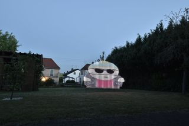

# WLED Painter
Light paints pictures in the dark.

The WLED Painter allows for painting images into the night or twilight. The WLED Paint sends images column by column scaled to a WELD Controller. These images can then be captured with a long exposure. Either the camera moves or the WLED strip moves. Light painting similar to using an old television set - but other way.

You need a microcontroller with WLED installed and an LED strip. The WLED software by default provides an access point, and the controller can be accessed at http://wled. For details and information about this incredibly amazing software, visit [/kno.wled.ge/](https://kno.wled.ge/).

With the setup button, you can adjust the WLED Painter settings, including the host address, the number of LEDs, the length of the LED strip, the position of the controller, and the start delay.

Then you can load images, and WLED Painter informs you about the dimensions of the resulting image in centimeters and how long the painting process will take. However, these times should be considered as suggestions. WLED Painter sends the information to the controller via the fetch API, which may vary depending on the quality of the Wi-Fi connection, sometimes working well and other times not as well, or even failing completely with too short a time frame.

The WLED Painter is far from complete. The layout still looks terrible, a brightness setting for the WLED controller is missing, a better description is needed, and most importantly, field tests are required.

If you still find it interesting, I would appreciate feedback in the form of tests or images.

[wledpainter app](https://drgonzales.github.io/WledPainter/wledpainter.html)

[githup](https://github.com/DrGonzales/WledPainter)